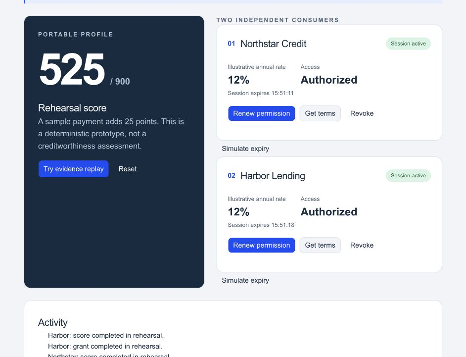
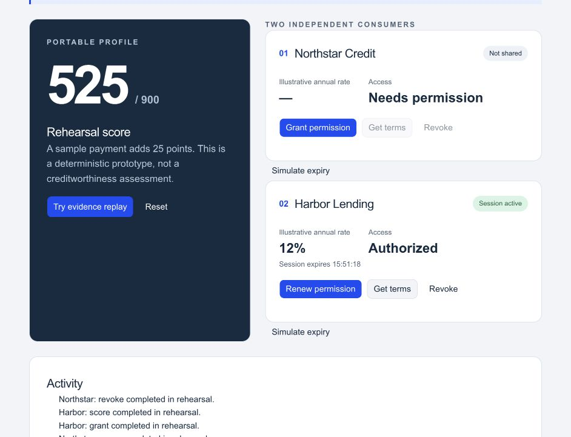

# Demo screenshots

Captured September 9, 2026 from the running local app, with no connected wallet,
no entered deployment addresses and no private data. App source is unchanged
from Day 2 (`4774052`). These are screenshots of **rehearsal**, not a deployed
contract, live proof, financial quote, or successful testnet transaction.

## Same sample profile, two consumers

Steps: add sample payment → grant Northstar → get terms → grant Harbor → get
terms. The page displays a sample score of 525 and two active sessions.

## Independent revocation

Click Northstar's Revoke. Its terms disappear and its Get terms control becomes
disabled, while Harbor remains active. This capture verifies that visible
rehearsal state, not a browser-wallet integration or the live native verifier.

The existing [hosted preview](https://advance-credit-demo.outstandingvick.chatgpt.site)
is owner-private. Public accessibility remains a release blocker; no audience
change was made as part of this security/documentation request.
